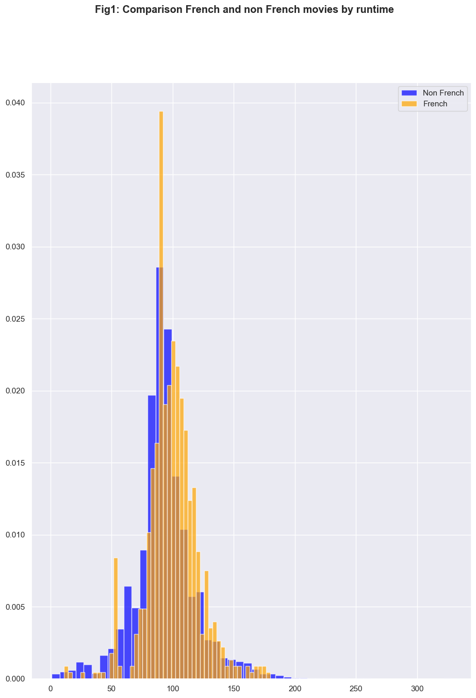

# streaming-film-service

# REPORT STREAMING-FILM SERVICE

## Executive Summary
A boutique streaming service, has analysed further insights by comparing and visualising KPIs such as runtime, year of the film, 
ratings and genre.
French films, when compared with non-French ones, are younger in the industry and overall better 
rated and with longer films. As there is no evident correlation between duration and rating, French 
producers and filmmakers should consider reducing the run time and focusing the budget in genres
with higher potential. Talk-show is not new, but a current niche in the film industry. Besides, they 
should maintain and reinforce the status in animation and investigate deeper in the fantasy field, by
seeking which features are scoring better and worse.
 ## Introduction
 ### 1. Background
French film is a boutique streaming service specialised in providing curated French-language options, 
such as movies, series or documentaries.
Following the analyst process from the first assignment, The streaming service wants to find more insights about film features according run time, ratings and genres, between others.
It has been considered French movies films where France is included inside the country field. That 
means, where country France has a participation, full or mainly partial.
 ### 2. Data Management Plan for Data Analysis 
|**STEPS**| **DESCRIPTION**|
|----------------------|------------------------------------------------------------------------------------------------------------------------------------------------------------------------------------------------------------------|
|Business Objective|• Offer selection of the current best rated | French language movies.|
|                  |• Make French language movies available for different age groups.|
|                  |• Identify the least tapped genres to provide filmmakers data to make original      content for French films.|
|What will the data produce?|•Comparison between films made by France and the rest of countries regarding run time.|
|                  |• Comparison between films made by France and the rest of the countries regarding ratings.|
|                  |• Distribution French films by genre|
|Preparation stage |•Source of data: provided by Canopy company, and third party data.|
|                  |• Type of study: Research.|
|                  |• Types of data: Structured data, both qualitative and quantitative. Reported data collection, csv files provided by Canopy company.|
|                  |• Methodology for data collection: Secondary data collection from Rotten Tomatoes and I  MDb|
|Organisation stage|• Data has been provided in one csv file: Dataset movies details.
|                  |• Once it has been cleaned, wrangled and modelling the data, it will be stored in data warehousing, such as Microsoft Azure Synapse Analytics.
|                  |• Canopy company also has a personal computer cloud as a backup.
|                  |• Data security and sharing will be process by the IT department.|
|                  |• Data security and sharing will be process by the IT department.|
|Analysis stage    |• Cleaning directly in the csv. Filtering the runtime and searching for the films with longer
|                  |duration in order to check the outliers. Four of the films had wrong runtime, the other twenty were real outliers.| 
|                  |• Importing csv file into Jupiter Notebook. It has been used Visual Studio Code as editor,which supports Jupiter Notebook.|
|                  |• Clean and select the dataset by using Pandas and Numpy.|
|                  |• Modelling. Combine and filter data.|
|                  |• Analyse and visualise the results with Matplotlib, Seaborn and Bokeh|
|                  |• Communicate the insights according the patterns and trends form the analysis|
|Comments/thoughts |• As the csv file Movie details dataset is the same one than in the assignment 1, cleaning was already done. The only additional field that it has been inspected in deep it has been Run time according true outliers.| 
## Findings. View and understand basic information.
### Cleaning registers in the csv file
Based on Run Time there were 28 films noticeable longer than the average. The research allowed 
to correct nine wrong registers and showed that the others were due to their film serial format, such
as Custer’s Last Stand.
The rest of the fields were already cleaned, nevertheless it has been removed again the non 
alphanumeric characters.
### Importing data to Jupiter Notebook
• Import pandas and numpy
• Import both csv using the call pd.read_csv(file)
### Data Selection and cleaning in Jupiter Notebook
It has been removed the non alphanumeric characters with a function:

def normalize_title(title):

characters_to_remove = r'[!@#$%^&*<>?/():;",.~`]:'

for c in characters_to_remove:

 title = title.replace(c, '')

 return title.lower()

df_movies

 **Create Average ratio field**

As in the assignment 1, Rotten Tomatoes and IMDb ratings have been consolidated into a new 
field containing with the average (mean) when both ratios are provided, or the provided IMDb 
rating otherwise. At the same time, mean function, excludes NaN values. Remember that the data 
only provides Rotten Tomatoes ratings for 55% of the registers. When provided, Rotten tomatoes 
+ratings have been converted to the same range than IMDb ones.

**Split the dataframe in two new ones**

• Selected the movies where France is included in the country field creating the dataframe 
“French_movies” It has been applied str.contains. Function notna for deleting NaN 
registers.

• Created another dataframe for non French movies, “non_french_movies”
## Wrangling data
### Compare French and non French movies according runtime

To answer if French films have longer films than other countries, it has been created a histogram
with Matplotlib. Histogram is used to compare the frequency distribution of French and non French 
films according their duration. The plot shows a normal distribution, almost symmetrical, for both of 
them. Nevertheless, French movies have in their central tendency, the median, longer run times 
than the non French.
Each bin represents the number of films group by their runtime divided for the total of films of each 
data frame. Therefore, it has compared both data sets relatively. 
It takes the attention two outliers at the left of the central point in the French movies, 60 minutes 
duration and 80 minutes, which is this last the bar code with more French films.

### Compare French and non French movies according ratings

To answer if French movies make better movies accord their rating, it has been created again a 
histogram with Matplotlib. This time, the plot shows more left skewed shape than the last plot in 
French movies, highlighting a drop, from both data sets around the rating 7. Clearly, French movies
have better rating than non French movies
**Distribution French films by genres**

 **Distribution non French films by genres**
 
To answer about the distribution and combination of genres in the French movies, it has been used
an explanatory pie chart showing percentage by genre. Nevertheless
comparing French and non French movies in a pie chart by genre, shows us in which percentages 
are more concentrated films. In addition, it has considered as well to compare them with non 
French movies in order to give better advice to Filmmakers. 
Non French movies are more concentrated in the genres: War, Sci-Fi, Animation and Reality TV.
French movies are more concentrated in the genres: Fantasy, Animation, Musical and Western

### Distribution of films by genres in boxenplots

[Boxenplots]https://towardsdatascience.com/letter-value-plot-the-easy-to-understand-boxplot-for-large-datasets-12d6c1279c97 have been generated in order to explain in an exploratory way the distribution of genres according two KPIs, timeline and runtime. 
Despite it has been asked to investigate about the combination of genres in the French movies, it 
has been considered that by comparing them with the rest of the countries would enrich the 
results.
After a failed facetgrid, created in seaborn and still in the Jupiter Notebook, where it was little 
insightful in its result, it was displayed a series of boxenplots. It was thought that by creating a plot 
with all possible genre combinations could be very confusing because the elevated number, 
instead, these three boxenplots are showing different aspects about genre distribution.
Boxenplots allow to check if the data is skewed, grouped and how outliers have been spread. 

**Figure 4: Distribution of films by genre and rating**
Over the total of films, distribution between genre and run time shows which of them have a 
concentration in their median values (coloured in darker red). 
Talk-Show has more 50% of its distribution in the median, been between 60 and 100 minutes. On 
the contrary; drama and romance are the genres with a major distribution, meaning there are less 
uniformity according run time.

**Figure 5: Distribution of films by genre and timeline**
This plot is very insightful because shows a tendency with all the films along the time. Some 
highlights are:
• Film-Noir are practically out of the market nowadays, having a peak in the 50’ and 60’. 
• Westerns is one of the most solid and worked genres with a decreased tendency since 
2005.
• New genres are game-show, news and reality TV

**Figure 6: Distribution of French films by genre and timeline**
According French films, the timeline started later than the rest of the countries (Mainly, North 
Americans films). Some highlights:
• It has four genres less than the rest of the countries: film-noir, talk-show, game-show, 
reality-tv. The first one because was an obsolete genre when French films started. The 
other three are probably so new and with less rating for the moment.
• It takes the attention that short films, musical, sport and news have stopped to be produced
since the last decade.

**Figure 7.1, 7.2: Distribution French and non French by genre and rating**
Non French movies: Better rating in: biography, documentary, history, music, news. Worse rating 
in: talk-show, fantasy, horror, sci-fi, thriller
French movies: Better rating in: animation, family, music, news. Worse rating: fantasy, horror, SciFi.

###  Seeking correlation between Runtime and Rating

In order to seek a possible correlation between runtime and rating, it has been created in Bokeh an
interactive scatter plot using hover tooltip. Despite the image png can not displayed interactions, 
the plot do not show a correlation but allow to see that the more rated are the films, the more 
dispersion according run time have. From rating 4, films are starting to split.

## Conclusion according analysis
Full French produced films are just 0.98% from the total of films. Co-productions with other 
countries is the current economical way for non Northern American produced movies. 
The graphs displayed through Matplotlib, Seaborn and Bokeh in the notebook have compared and 
analised some of the most relevant KPIs. French movies are generally longer than non french 
movies and better rated. As they are producing less films and probably have more economical 
limitations because the film industry is less developed, those films only can compete in the market 
with quality. 
The most popular genre between French movies is Fantasy, with 25.54%, following by Animation 
with 9.15%. The timeline by genre (fig 5) shows us that both genres are mostly concentrated in the 
last fifteen years. It is very noticeable that Fantasy has the best and the worse films. That means 
there is a wide range in this genre.
French films started later than the rest of the countries, mainly, with Northern American films. 
French films have been focused in different genres than the rest of the countries, no showing 
interest in the most popular one, war following by Sci-Fic.

## Recommendations
According to the analysis, if French movies wants to make a difference, they should compete with 
quality because can not compete with quantity. 
Co-productions is a good recipe for its economical viability. Also, collaboration between different 
cultural styles open the films to a broader public and create an enriched content.
According to runtime, the scatter plot does not show correlation between duration and rating, and 
French and non French films have similar behaviour. French films are usually longer than the 
others. If that is translated to more expensive productions, maybe they should consider make 
shorter films.
Besides, non French movies should be make a research not just in rating but in which is the best 
combination of genres the viewers prefer.
Last recommendation, and possibly a niche in the market is the talk-show. It is not a new one, not 
worked by French movies, but is having an increasing interest and is not well rated for the moment.
Despite the analysis done with the dataset provided, analyst suggests than they could dive deeper 
with additional data

## Ethical guidelines
Among all the data collected for this assignment, it has been divided between objective and 
subjective data. 
Among the subjective data, the csv file collects age recommendation, who is established by 
regulated corps and differ depending of the country according a rating system. 
15
Besides the recommendation age, subjective data fall on the film rating, provided by Rotten 
Tomatoes and Imdb. 
Rotten Tomatoes uses the tomatometer, which follows a criteria developing a series of key values. 
According Imdb, they collect data providing to the users an extended guide about how to rate and 
manage the information.
By doing that, they are building trust in the audience, along a sense of honesty and integrity. Imdb 
also explains in detail through Ratings FAQ how the information users is going to be manage.
To know how your data sources apply ethical policies, add value and transparency to the analyst 
work.

## References
Wikipedia, 2022, Motion picture content rating system, viewed 10 September 2022,
<https://en.wikipedia.org/wiki/Motion_picture_content_rating_system#:~:text=A%20motion
%20picture%20content%20rating%20system%20is%20an,matters%20typically%20deemed
%20unsuitable%20for%20children%20or%20adolescents/>
Rotten Tomatoes, 2022, Tomatometer Criteria, viewed 10 September 2022,
<https://www.rottentomatoes.com/critics/criteria>
Imdb, 2022, Help Center, viewed 10 September 2022,
<https://help.imdb.com/article/imdb/track-movies-tv/ratings-faq/G67Y87TFYYP6TWAV#>
Zach, 2021,Symmetric Distribution:Definition + Examples/ Statology, viewed 10 September 2022,
<https://www.statology.org/symmetric-distribution/>
Davis, K., 2022, When to Use a Histogram in Data Analysis/The Web Writer Spotlight, viewed 10 
September 2022,
<https://webwriterspotlight.com/when-to-use-a-histogram-in-data-analysis>
Meisner,D, 2020, Letter Value Plot-The easy to understand boxplot for large datasets/Towards Data 
Science, viewed 9 September 2022
<https://towardsdatascience.com/letter-value-plot-the-easy-to-understand-boxplot-for-largedatasets-12d6c1279c97>
Statista, 2021, Cinema industry in France – statistics & facts/ Statista, viewed 9 September 2022
<https://www.statista.com/topics/6455/cinema-industry-in-france/#topicHeader__wrapper>
Geeks for geeks,2022, GeeksforGeeks, viewed 29 August 2022
<https://www.geeksforgeeks.org/>
Stack overflow,2022, Stackoverflow, viewed 29 August 2022
<https://stackoverflow.com/>
Seaborn,2022, Seaborn, viewed 29 August 2022
16
<https://seaborn.pydata.org/>
Matplotlib,2022, Matplotlib, viewed 29 August 2022
<https://matplotlib.org/>
Bokeh,2022, Bokeh, viewed 29 August 2022
<http://bokeh.org/